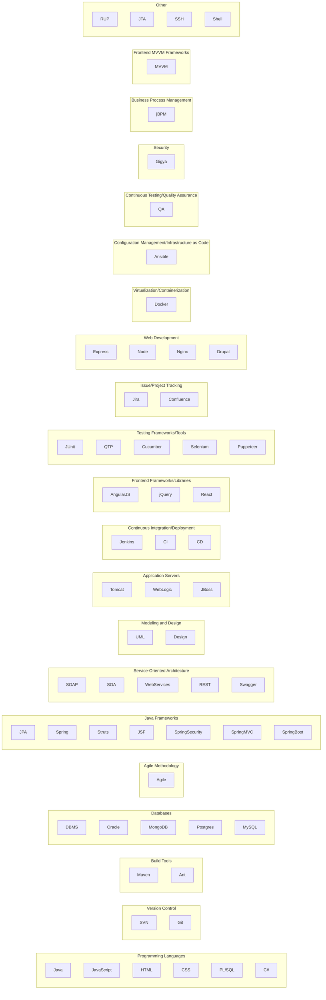

# Svelte + TS + Vite

This template should help get you started developing with Svelte and TypeScript in Vite.

## requirements
eslint


## develop

yarn data
yarn dev


### security

check 
```bash
https://github.com/<repository>/security/dependabot
```


## preview

build & preview

```sh
yarn build
yarn preview
```


## heroku

### deploy develop on heroku

create
```sh
heroku git:remote -a jcc2303
```

changes
```sh
git push heroku develop:main
heroku ps:scale web=1
heroku open
# https://jcc2303.herokuapp.com/
```

heroku logs --tail


## preview in heroku local 

```sh
heroku local web
```

## preview in heroku develop

```sh
git push heroku feature/<XYZ>:main -f
```


### docker - develop 

```sh
docker build -t jcc2303 .
docker run -p 5000:3000 jcc2303   
# -> CMD ->  npm run start ->  node server -> localhost:3000
```

### deploy

#### deploy github

```sh
git commit -a --amend -m "[reason]: message" && git push -f
```

- github config env
- Environments / Configure develop-deploy / protection rules / Deployment branches
- github notification


## business model




graph TB

```mermaid
graph LR
    subgraph Development
        subgraph Java_Ecosystem
            subgraph Java_Frameworks
                spring
                springmvc
                struts
                jsf
                springboot
                richfaces
            end
            subgraph Java_Libraries
                hibernate
                jpa
                jms
                jdbc
                jta
                jackson
                junit
                log4j
                slf4j
            end
            java -->|uses| spring
            java -->|uses| hibernate
            java -->|uses| jpa
            java -->|uses| jms
        end
        subgraph Web_Technologies
            html
            css
            javascript
            jquery
            angularjs
            react
            vue
            node -->|uses| express
            express -->|uses| spring
            struts -->|uses| spring
            jboss -->|uses| spring
            tomcat -->|uses| spring
            weblogic -->|uses| spring
            jbpm -->|uses| spring
            html -->|uses| css
            html -->|uses| javascript
            css -->|uses| javascript
            css -->|uses| html
            frontend -->|includes| html
            frontend -->|includes| css
            frontend -->|includes| javascript
            frontend -->|includes| jquery
            frontend -->|includes| angularjs
            frontend -->|includes| react
            frontend -->|includes| vue
            backend -->|includes| node
            backend -->|includes| express
            backend -->|includes| spring
            backend -->|includes| struts
            backend -->|includes| jboss
            backend -->|includes| tomcat
            backend -->|includes| weblogic
            backend -->|includes| jbpm
            database -->|includes| dbms
            database -->|includes| oracle
            database -->|includes| mysql
            database -->|includes| postgres
            database -->|includes| mongodb
        end
        subgraph DevOps
            subgraph Version_Control
                svn
                git
                bitbucket
            end
            subgraph Build_Automation
                maven
                ant
                gulp
            end
            subgraph Continuous_Integration
                jenkins
                circleci
            end
            subgraph Deployment
                docker
                heroku
                ansible
                kubernetes
                nginx
                shell
                ssh
            end
            svn -->|uses| git
            git -->|uses| bitbucket
            maven -->|uses| ant
            maven -->|uses| gulp
            jenkins -->|uses| docker
            jenkins -->|uses| heroku
            jenkins -->|uses| ansible
            jenkins -->|uses| kubernetes
            jenkins -->|uses| nginx
            jenkins -->|uses| shell
            jenkins -->|uses| ssh
        end
        subgraph Testing
            subgraph Unit_Testing
                junit
                jest
                qunit
            end
            subgraph Functional_Testing
                cucumber
                selenium
                puppeteer
                qtp
            end
            subgraph Test_Management
                jira
                confluence
            end
            junit -->|uses| java
            jest -->|uses| javascript
            jest -->|uses| react
            jest -->|uses| vue
            qunit -->|uses| javascript
            cucumber -->|uses| java
            cucumber -->|uses| javascript
            cucumber -->|uses| react
            cucumber -->|uses| vue
            selenium -->|uses| java
            selenium -->|uses| javascript
            selenium -->|uses| react
            selenium -->|uses| vue
            puppeteer -->|uses| javascript
            puppeteer -->|uses| react
            puppeteer -->|uses| vue
            qtp -->|uses| java
            jira -->|uses| confluence
        end
    end
    subgraph Project_Management
        subgraph Agile_Frameworks
            agile
            rup
            scrum
            agile -->|uses| rup
            agile -->|uses| scrum
        end
    end
    subgraph Design_Patterns
        subgraph Architectural_Patterns
            mvc
            mvp
            mvvm
            mvc -->|uses| spring
            mvp -->|uses| spring
            mvvm -->|uses| react
            mvvm -->|uses| vue
        end
    end
    subgraph Documentation
        uml
        swagger
    end
    subgraph Other_Concepts
        plsql
        soap
        rest
        web_services
        xml
        html -->|uses| xml
        css -->|uses| xml
        ci -->|includes| maven
        ci -->|includes| jenkins
        ci -->|includes| docker
        cd -->|includes| jenkins
        shell -->|uses| ssh
    end

```


